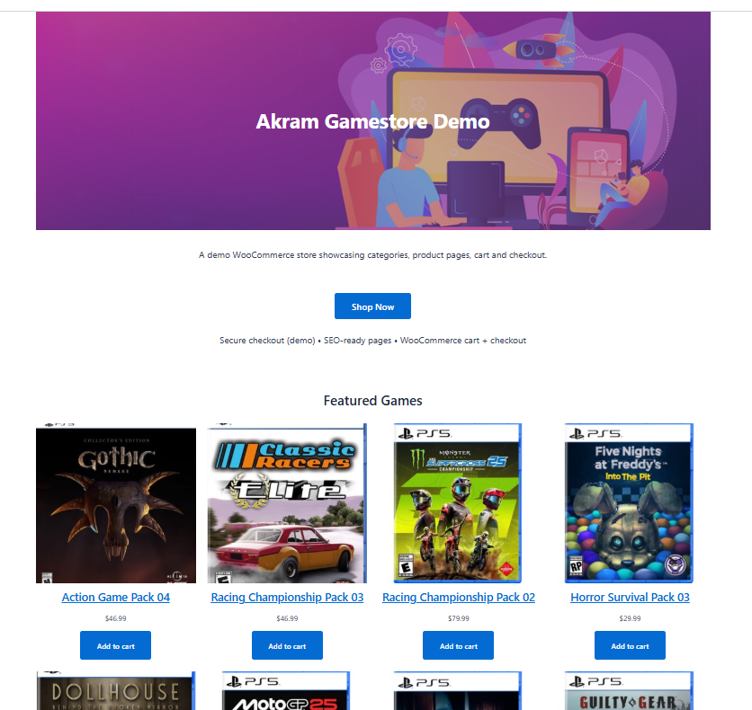
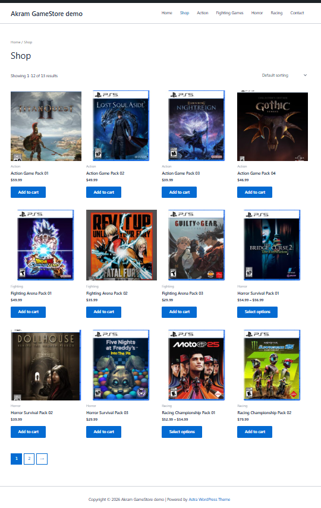
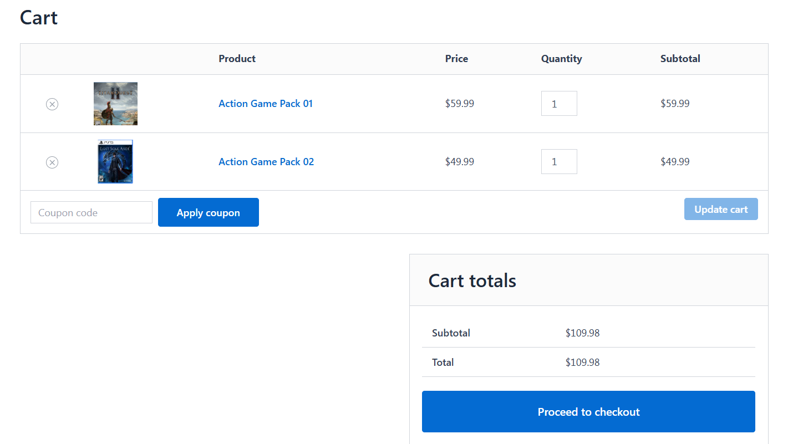
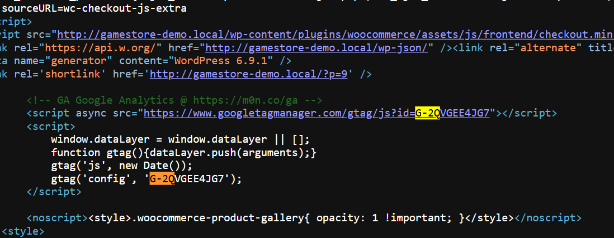

# Akrama GameStore Demo (WordPress + WooCommerce)

A portfolio demo e-commerce website built with **WordPress + WooCommerce** to showcase a clean storefront experience: homepage hero + CTA, featured products, category navigation, product pages, cart, and checkout.

## Live Demo
Local demo (LocalWP): `gamestore-demo.local`  
(Deployed demo can be provided on request.)

## Key Features
- WordPress pages built with the block editor (**Homepage + Contact**)
- WooCommerce shop with products, categories, and add-to-cart flow
- Featured products section (**“Featured Games”**) on the homepage
- Basic on-page SEO (**permalinks, titles/meta via Rank Math, image alt text**)
- **GA4 analytics tagging** (Measurement ID installed + verified in page source)
- Backup + maintenance basics (**UpdraftPlus**)

## Proof (Quick Highlights)
✅ **GA4 tag installed** (gtag present in page source)  
✅ **WooCommerce flow works:** Shop → Product → Cart → Checkout  
✅ **Backup created** with UpdraftPlus

## Screenshots

### Home (Hero + CTA + Featured Games)

### Shop (Product Grid + Add to Cart)

### Cart

### GA4 Tag Proof (gtag + Measurement ID)

More screenshots: `docs/screenshots/`  
(See: header/menu, product page, checkout, and full GA4 proof.)

## Tech Stack
- WordPress + WooCommerce
- Astra theme
- Rank Math SEO
- Google Analytics 4 (GA4)
- UpdraftPlus (backups)

## How to Run Locally (High Level)
1. Create a local WordPress site (LocalWP)
2. Install: WooCommerce, Astra, Rank Math, UpdraftPlus
3. Import content (optional): `docs/wp-export.xml`
4. Configure products + categories
5. Add GA4 Measurement ID and verify via **View Page Source**

## Notes
This is a portfolio demo site. Orders are not fulfilled.
